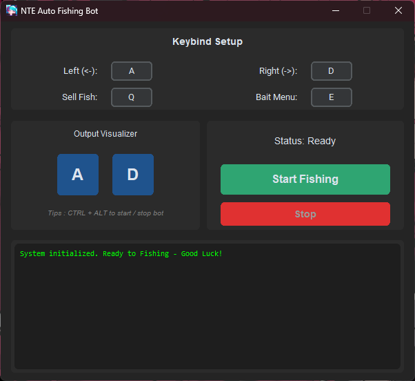
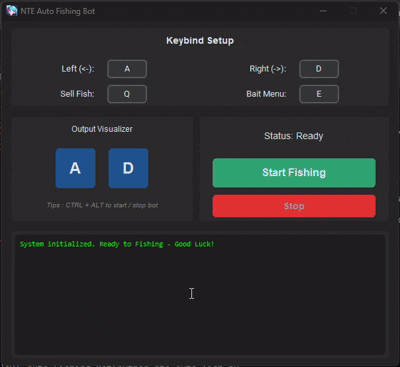

# NTE-Auto-Fishing-Bot
Python automation bot for fishing in Neverness To Everness.

---

## 🌟 Features

- **100% Visual Based**: Uses OpenCV (`cv2`) to accurately read the game UI.
- **Humanized Anti-Macro Detection**: Mouse movements use easing algorithms, randomized coordinates (jitter), and randomized delays to avoid flags.
- **Auto Minigame**: Automatically tracks the tension bar and keeps the cursor in the safe zone.
- **Smart Auto-Inventory**: Automatically detects when you run out of bait, navigates to the Tackle Shop, sells your fish, bulk purchases Universal Bait, and auto-equips it. 
- **Customizable Keybinds**: Intuitive GUI to set your own keys. Configurations are automatically saved to `settings.json`.

---

## ⚠️ Important Requirements

- **Resolution**: This bot is highly optimized for **1920x1080 (1080p) 16:9**. Using other resolutions such as 1440p (2K), 4K, or Ultrawide (21:9) is supported via dynamic scaling, but currently considered **experimental**. If the bot behaves unexpectedly or clicks miss their targets, please set your game resolution to 1080p.
- **Primary Monitor**: The game must be running on your **Primary Monitor (Monitor 1)** if you are using a multi-monitor setup.
- **Upscaling & Frame Gen**: Please disable any Upscaling (DLSS / FSR) and Frame Generation (MFG). These technologies can blur or distort UI pixels, preventing the bot from "seeing" the minigame. High framerates (e.g., native 120 FPS) are fully supported.
- **Run as Administrator**: If you run from source, **you MUST run your terminal/command prompt as Administrator**. If you use the Prebuilt Executable, it is already configured with UAC-Admin and will prompt automatically.
- **Do Not Interfere**: Once the bot starts and the game is active, DO NOT move your physical mouse or press any keys, as it will disrupt the bot's automated movements and macro timings.

> **Disclaimer**: This program works purely as a macro reading screen pixels. It does not inject into the game memory or replace any game files. However, please read the in-game TOS regarding macros. **ONLY FOR AFK! DWYOR (Do It At Your Own Risk)!!**

---

## 🎥 Preview

Check Youtube for preview: [Watch on YouTube](https://youtu.be/r-Q7z-c2ZGw)

<details>
<summary><b>Click to view Image & GIF Preview</b></summary>
<br>





</details>

---

## 🚀 Getting Started

### Option 1: Prebuilt Executable (GUI)
1. Download the latest `nte-auto-fish.zip` from [Releases](https://github.com/dbayz/NTE-Auto-Fishing-Bot/releases).
2. Extract the file and run the `.exe`. *(It will automatically request Administrator privileges via UAC)*.
3. Configure your keybinds, click **START**, and immediately tab into the game window.

### Option 2: Run From Source (Recommended)
You need Python 3.x installed on your system.

```bash
# 1. Clone the repository
git clone https://github.com/dbayz/NTE-Auto-Fishing-Bot.git
cd NTE-Auto-Fishing-Bot

# 2. Install required dependencies
pip install -r requirements.txt
```

Launch the GUI:
*(Make sure your Command Prompt or PowerShell is running as Administrator!)*
```bash
python nte-auto-fish.py
```
